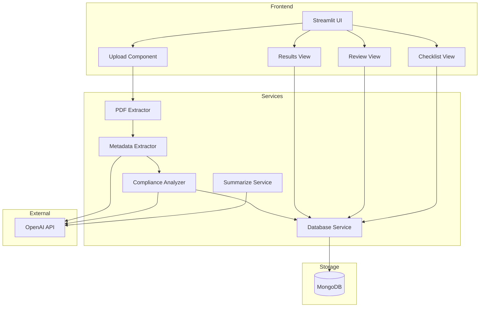
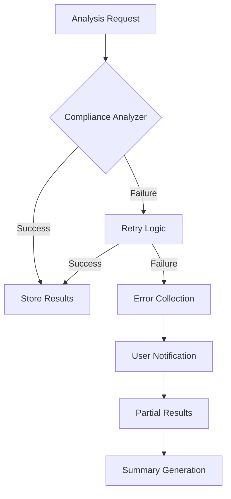
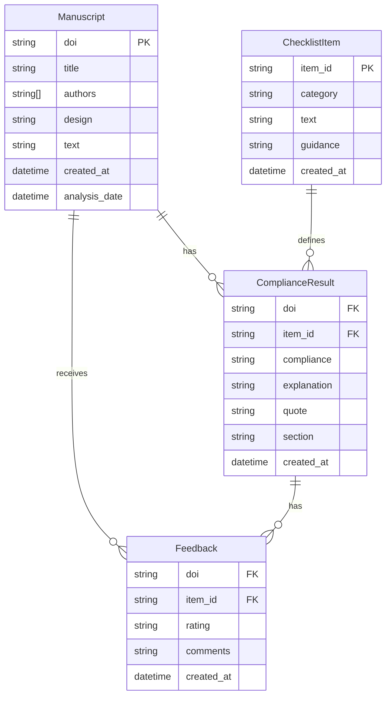

# ReproAI Architecture

## System Overview

ReproAI is a tool for analyzing scientific manuscripts for reproducibility compliance. The system consists of a Streamlit web interface, a MongoDB database for storage, and various services for manuscript analysis.

## Architecture Diagram



## Component Descriptions

### Frontend Components
- **Streamlit UI**: Main web interface for user interaction
- **Upload Component**: Handles manuscript PDF uploads
- **Results View**: Shows compliance score and high-level overview
- **Review View**: Detailed analysis with feedback options
- **Checklist View**: Manages compliance checklist items

### Services
- **PDF Extractor**: Extracts text content from PDF files
- **Metadata Extractor**: Uses OpenAI to extract metadata (title, authors, etc.)
- **Compliance Analyzer**: Analyzes manuscript for reproducibility compliance
- **Database Service**: Handles all database operations
- **Summarize Service**: Generates summaries of compliance analysis

### Storage
- **MongoDB**: Stores manuscripts, analysis results, and user feedback

## Error Handling

ReproAI implements a robust error handling system:

1. **Compliance Analysis**
   - Automatic retry mechanism for failed checklist items
   - 5-second delay between retries to handle rate limits
   - Detailed error collection and reporting
   - Progress tracking for partial completions

2. **User Feedback**
   - Clear error messages in the UI
   - Warning indicators for partial analyses
   - Real-time progress updates
   - Detailed error traces for debugging

3. **Data Integrity**
   - Transaction-based database operations
   - Validation of all user inputs
   - Schema validation for API responses
   - Automatic data cleanup

## Components

### Frontend (Streamlit)

- **Upload Component**
  - PDF file validation
  - Progress tracking
  - Error reporting

- **Results View**
  - Compliance score calculation
  - Analysis completeness indicators
  - Error and warning displays

- **Review View**
  - Detailed analysis results
  - User feedback collection
  - Error correction interface

### Services

- **PDF Extractor**
  - Text extraction
  - Error handling for corrupted files
  - Progress tracking

- **Metadata Extractor**
  - Title, authors, DOI extraction
  - Discipline classification
  - Schema validation
  - Retry mechanism

- **Compliance Analyzer**
  - 22-item checklist analysis
  - Automatic retries for failed items
  - Error collection and reporting
  - Progress tracking
  - Rate limit handling

- **Database Service**
  - MongoDB operations
  - Transaction support
  - Error handling
  - Data validation

- **Summarize Service**
  - Result aggregation
  - Category-based analysis
  - Error handling for partial results

### Data Models

- **Manuscript**
  - Basic metadata (title, authors, DOI)
  - Extended metadata (discipline, design)
  - Analysis status tracking
  - Validation rules

- **ComplianceResult**
  - Analysis results
  - Supporting evidence
  - Error tracking
  - Validation schema

- **Feedback**
  - User corrections
  - Quality metrics
  - Validation rules

## Error Flow



## Database Schema



## Configuration

The app uses Streamlit's secrets management for configuration:

```toml
# .streamlit/secrets.toml
MONGODB_URI = "mongodb connection string"
OPENAI_API_KEY = "openai api key"
```

For Streamlit Cloud deployment, these secrets are configured in the Streamlit Cloud dashboard.

## Directory Structure

```
reproai/
├── app/
│   ├── models/          # Data models
│   ├── pages/          # UI pages
│   ├── prompts/        # LLM prompts
│   └── services/       # Business logic
├── docs/              # Documentation
├── scripts/           # Utility scripts
├── .streamlit/        # Streamlit config
├── streamlit_app.py   # Main app
└── requirements.txt   # Dependencies
```

## Security Considerations

1. Secrets Management
   - Sensitive data stored in Streamlit secrets
   - No hardcoded credentials in code
   - .streamlit/secrets.toml ignored by git

2. Database Security
   - MongoDB Atlas with secure connection
   - Minimal database user permissions
   - Connection string in secrets

3. API Security
   - OpenAI API key in secrets
   - Rate limiting on API calls
   - Error handling for API failures
