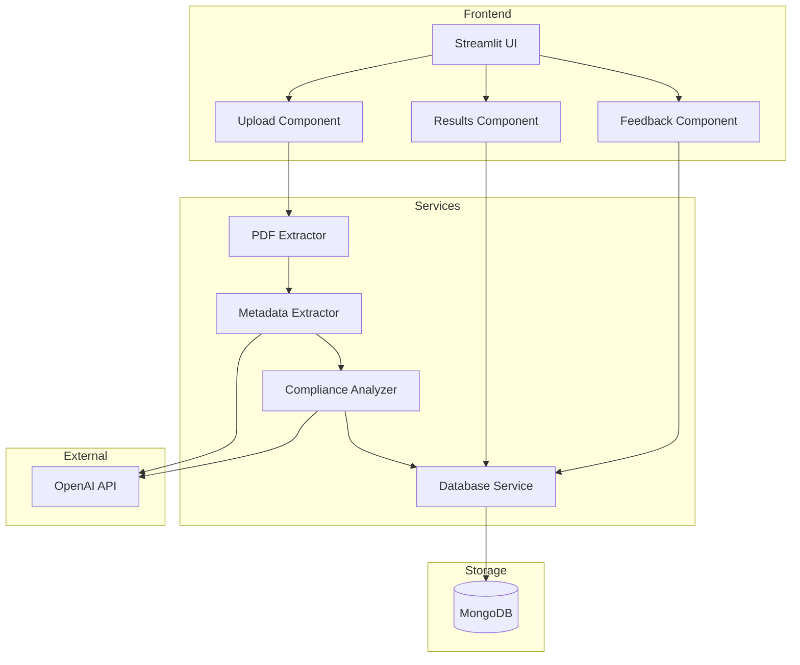
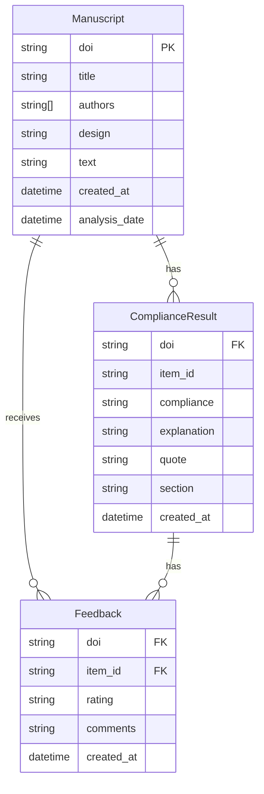
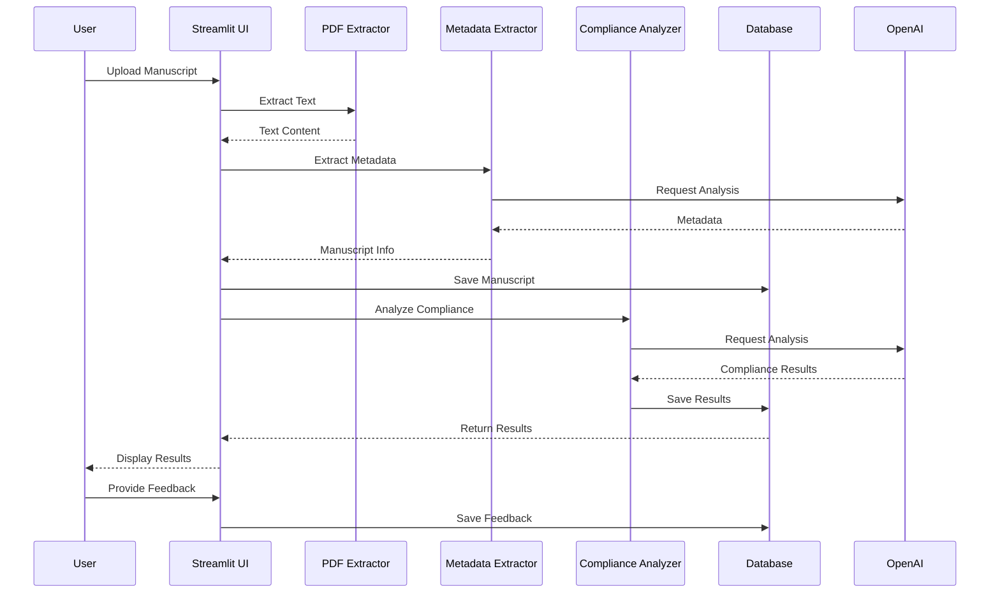

# ReproAI Architecture

## System Overview

ReproAI is a tool for analyzing scientific manuscripts for reproducibility compliance. The system consists of a Streamlit web interface, a MongoDB database for storage, and various services for manuscript analysis.

## Architecture Diagram

## Component Descriptions

### Frontend Components
- **Streamlit UI**: Main web interface for user interaction
- **Upload Component**: Handles manuscript PDF uploads
- **Results Component**: Displays compliance analysis results
- **Feedback Component**: Allows users to provide feedback on analysis results

### Services
- **PDF Extractor**: Extracts text content from PDF files
- **Metadata Extractor**: Uses OpenAI to extract metadata (title, authors, etc.)
- **Compliance Analyzer**: Analyzes manuscript for reproducibility compliance
- **Database Service**: Handles all database operations

### Storage
- **MongoDB**: Stores manuscripts, analysis results, and user feedback

## Database Schema

## Workflow

## Environment Setup

The application requires the following environment variables:
- `MONGODB_URI`: MongoDB connection string
- `OPENAI_API_KEY`: OpenAI API key for manuscript analysis

## API Documentation

### Database Service

The database service provides the following operations:
- `save_manuscript(manuscript: Manuscript)`: Save a new manuscript
- `get_manuscript(doi: str)`: Retrieve a manuscript by DOI
- `save_compliance_results(results: List[ComplianceResult])`: Save compliance analysis results
- `get_compliance_results(doi: str)`: Get compliance results for a manuscript
- `save_feedback(feedback: Feedback)`: Save user feedback
- `get_feedback(doi: str, item_id: str)`: Get feedback for a specific compliance item
